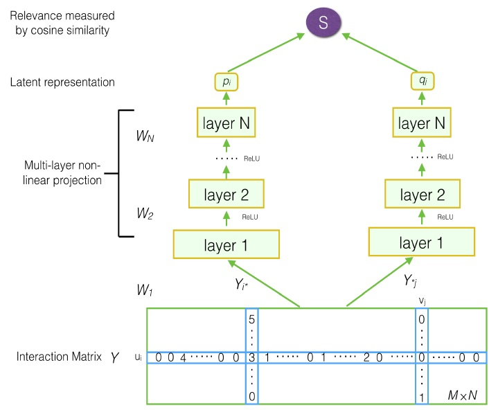
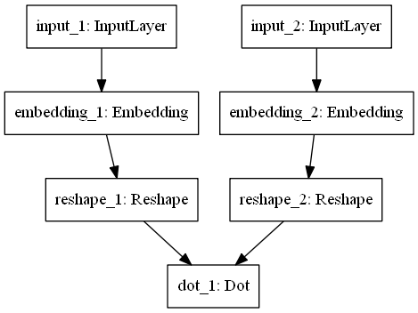
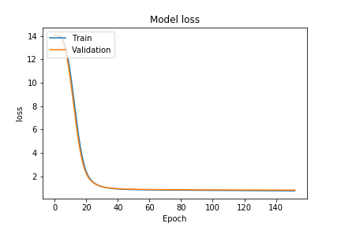
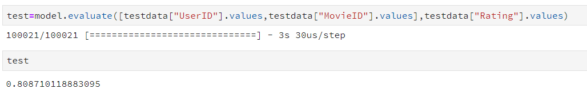

<h1 style="text-align: center"> 基于矩阵分解算法的评分预测实现 </h1>
<div style="text-align: center"><big>邢政     2017060801025</big></div>
<div style="text-align: center"><small>12 - 7 - 2019</small></div>


___

>协同过滤在推荐系统领域有着广泛的应用。矩阵分解算法是其中具有代表性的算法之一。在本次课程作业中，针对于ml-1m数据集，我们利用了pandas进行数据的读取和划分，8/10为训练集，1/10为验证集，1/10为测试集。并且，我们使用keras实现了一个简单的神经网络模型来拟合一个矩阵分解算法。由于数据集较小的缘故，我们使用了早停的方式来防止模型对数据集过拟合。在训练集上，模型的loss降低至**0.75**，在验证集和测试集上，模型的loss也只有**0.80**。


## Introduction

 在这篇报告中主要是介绍我们所使用的数据集以及我们的算法的原理。代码上传在了github上，请点击[传送门](https://github.com/xz1220/HomeworkForInformationRetrieval)。

#### Movielens Datastes

movielens 数据集收集了许多人关于不同电影的评价。这次我们所使用的是其中一个版本，有**1000209**条评价记录。
数据集总共有分为三个部分——users、movies和rating。

- users
  - Gender ：表示性别。M代表男性，F代表女性。
  - Age ：1 表示小于18岁；18 意味着年龄在 18-24 之间；25 意味着年龄在 25-34 之间；以此类推。
  - Occupation ：表示职业。

- movies
  - Title ：代表电影的名字，包含有电影发售的年份。
  - Genres ：代表电影的类别。

- rating
  - UserId ：代表用户的唯一标识号。
  - MoviesId :代表电影的唯一标识号。
  - Rating: 表达了一个用户对于一部电影的喜恶程度。

对于本次课程作业来说，有用的数据只有rating文件夹里面的UserId、MoviesId以及Rating。我们需要做的就是将这三列数据提取出来并且各自做处理。

#### Matrix Factorization
矩阵分解算法是协同过滤算法的一种。它在2006年获得了Netflix推荐大赛的奖项，在整个推荐系统发展史上具有举足轻重的地位，对促进推荐系统的大规模发展及工业应用功不可没。
##### 核心思想
一个用户的操作行为可以转化为行为矩阵$R \in R^{n \times n}$，其中$R_{i,j}$代表了用户i对物品j的评分。矩阵分解算法就是将用户评分矩阵R分解为两个矩阵$U_{n \times k}$和$V_{k \times m}$的乘积。
$$
R_{n \times n} = U_{n \times k} \times V_{k \times m}
$$
其中，$U_{n \times k}$代表用户特征矩阵，$V_{k \times m}$代表的是物体特征矩阵。而某个用户对于某个目标物体的评分可以通过提取用户特征矩阵$U_{n \times k}$对应的行和物品特征矩阵$V_{k \times m}$对应的列相乘来得到。

矩阵分解的目的是通过机器学习的手段将用户行为矩阵中缺失的数据(用户没有评分的元素)填补完整，最终达到可以为用户做推荐的目标。

#### Neural Network
大名鼎鼎的神经网络，深度学习的基石之一，它的原理我就不再赘述了。

我要提的一点是：
>**万能近似定理**:只要隐含层的神经元足够多，一个两层的神经网络就可以你和任意复杂度的函数。


## Method
本次实验所使用的方法来自于《Deep Matrix Factorization Models for Recommender Systems》这篇文章。是作者根据神经网络提出的一种新的矩阵分解模型，发表在2017年的IJCAI上。

模型结构图如下：





作者的贡献有如下几点：
- 利用DMF将显示反馈输入中包含的用户和物品信息非线性地
映射到了一个低维空间。
- 提出一种既包含显式反馈又包含隐式反馈的损失函数。
- 在多个数据集上跑出来的效果都非常可观。

但是我们方法有一些不一样在于，我们的输入是一个pair，包含用户id和物品，分别通过两个embedding模块来生成两个k维向量，然后进行点乘，生成用户对物品的评分。整个过程相当于是根据已有评分数据，来拟合一个函数，用于填补矩阵缺失值。

在接下来的部分我们主要是讲解我们的代码。主要是对关键部分
的代码做一下说明。


### Data Processing
```python
'''
- UserIDs range between 1 and 6040 
- MovieIDs range between 1 and 3952
- Ratings are made on a 5-star scale (whole-star ratings only)
- Timestamp is represented in seconds since the epoch as returned by time(2)
- Each user has at least 20 ratings
'''
rating_data=pd.read_csv("./ml-1m/ratings.dat",header=None,names=["UserID","MovieID","Rating","Timestamp"],sep='::')
rating_data=rating_data.sample(frac=1)
#len(rating_data)
traindata=rating_data[:int(len(rating_data)*8/10)]
validdata=rating_data[int(len(rating_data)*8/10):int(len(rating_data)*9/10)]
testdata=rating_data[int(len(rating_data)*9/10):]
print(len(traindata),len(validdata),len(testdata))
```

上述代码读取rating的数据，并且通过sample的方法将数据打乱，然后按照8：1：1的比例划分数据集。

```python
train_user = traindata["UserID"].values
train_movie = traindata["MovieID"].values
train_x = [train_user,train_movie]
train_y = traindata["Rating"].values

valid_user = validdata["UserID"].values
valid_movie = validdata["MovieID"].values
valid_x = [valid_user,valid_movie]
valid_y = validdata["Rating"].values
```

读取对应的列的数据。

### Model
keras是一个深度学习框架，类似于tensorflow和pytorch。但是封装性更好。事实上，keras没有自己的计算引擎，它的后端是连接到tensorflow或者thenos。
模型的实现直接调用keras内部的方法进行组装便可。
embedding_1将输入映射到$N \times K$维度，而embedding_2将输入映射到$M \times K$维度。然后进行点乘运算，得到用户对与电影的评分，和原有的label算均方差loss，迭代优化，优化器为Adam。

```python
K.clear_session()
def Recmand_model(num_user,num_movie,k):
    input_uer = Input(shape=[None,],dtype="int32")
    print(input_uer)
    model_uer = Embedding(num_user+1,k,input_length = 1)(input_uer)
    model_uer = Reshape((k,))(model_uer)
    
    input_movie = Input(shape=[None,],dtype="int32")
    model_movie  = Embedding(num_movie+1,k,input_length = 1)(input_movie)
    model_movie = Reshape((k,))(model_movie)
    
    out = Dot(1)([model_uer,model_movie])
    model = Model(inputs=[input_uer,input_movie], outputs=out)
    model.compile(loss='mse', optimizer='Adam')
    model.summary()
    return model
```

下图是我们根据我们结构，用graphviz自动生成的模型结构图，可以看到，结构非常清晰，主要是两个embedding模块和最后的点乘。



由于我们划分了验证机和测试集，为了防止过拟合，我们在训练过程中对验证集进行测试，停止训练的策略为：当模型在验证集上的均方误差连续两个epoch都没有下降的时候，停止模型的训练。

下图是模型在训练过程中的loss的变化曲线，可以看到训练误差和验证误差之间的差距是非常的小的，以及它们的下降趋势是非常一致的。由于我们是随机划分的，这也说明了训练集和验证集之间的分布是趋于一致的。 



测试集上的loss也表现正常。




## Summary
通过这次课程实验，收获如下：

- 熟悉如何使用keras这个框架
- 熟悉DMF算法的原理以及实现
- 锻炼总结报告的能力

也收获了推荐究竟是怎么做到，对其有了一个简陋幼稚的概念。


